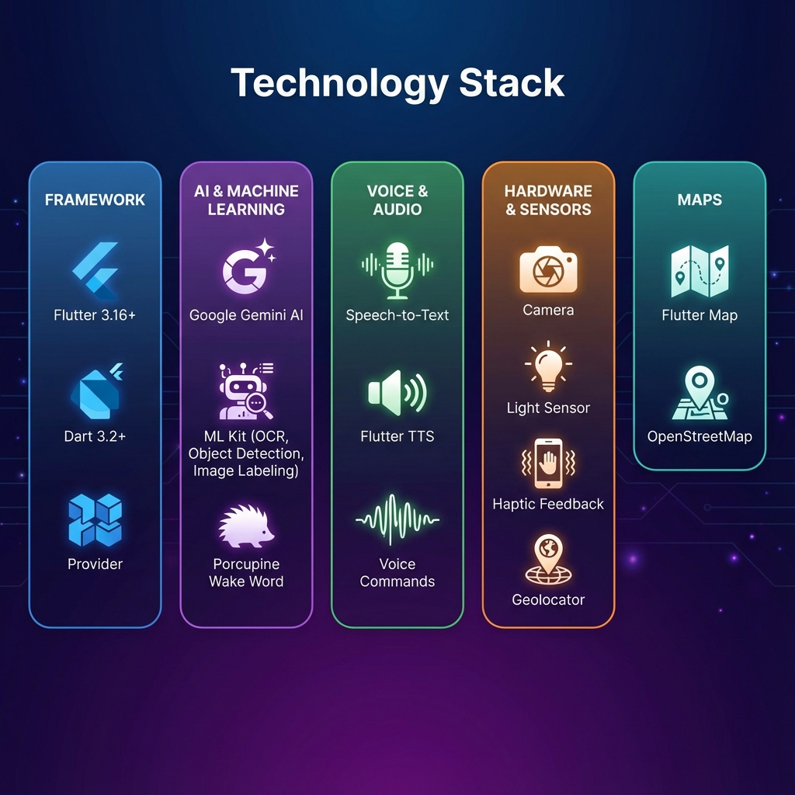
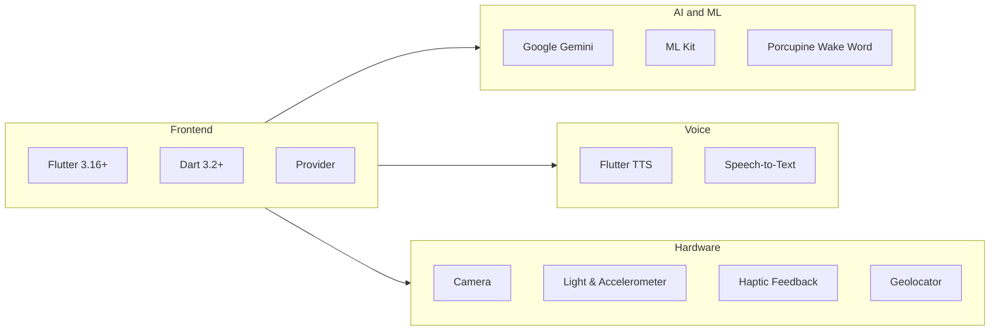

<div align="center">
  
  
  # DekhoSuno
  
  ### देखो सुनो — See the World, Hear the Difference
  
  [](https://flutter.dev)
  [](https://dart.dev)
  [](https://deepmind.google/technologies/gemini/)
  [](LICENSE)
  [](https://flutter.dev/multi-platform)

  <br/>
  
  **An AI-powered accessibility companion for individuals with sensory impairments**
  
  *Empowering the visually and hearing impaired through intelligent assistance*

  <br/>
  
  [📱 Features](#-features) • [🏗️ Architecture](#️-architecture) • [🚀 Getting Started](#-getting-started) • [📂 Project Structure](#-project-structure) • [🤝 Contributing](#-contributing)

</div>

---

## 🌟 Overview

**DekhoSuno** (Hindi: देखो सुनो — "See & Listen") is a comprehensive accessibility application that bridges the gap between technology and individuals with sensory impairments. Built with Flutter and powered by **Google Gemini AI**, it provides real-time assistance through two specialized modes:

| Mode | Target Users | Purpose |
|------|--------------|---------|
| 👁️ **देखो (Dekho)** | Hearing Impaired | Visual assistance to "see" sounds and conversations |
| 👂 **सुनो (Suno)** | Visually Impaired | Audio assistance to "hear" the visual world |

Both modes feature a **common AI Assistant** accessible anytime via the wake word **"Help Dekho Suno"** or gestures.

---

## 🏗️ Architecture

<div align="center">
  
  <br/>
  <i>Application Architecture & Feature Flow</i>
</div>

### Application Flow

```mermaid
%%{init: {'theme': 'base', 'themeVariables': { 'primaryColor': '#5B67CA', 'primaryTextColor': '#fff', 'primaryBorderColor': '#4A55B5', 'lineColor': '#6B7280', 'secondaryColor': '#10B981', 'tertiaryColor': '#F59E0B', 'background': '#1F2937', 'mainBkg': '#374151', 'nodeBorder': '#4B5563', 'clusterBkg': '#1F2937'}}}%%
flowchart TB
    subgraph Entry["🚀 App Entry"]
        direction TB
        Splash["Splash Screen"]
        Landing["Landing Screen<br/><i>The Switch</i>"]
    end

    subgraph Common["🤖 Common Features<br/><i>Available in Both Modes</i>"]
        direction TB
        AI["🧠 AI Assistant<br/><i>Voice + Text Chat</i><br/><i>Notes & Reminders</i>"]
        SOS["🚨 Shake SOS<br/><i>Emergency Alert</i>"]
        Settings["⚙️ Settings<br/><i>Preferences</i>"]
        WakeWord["🎤 Wake Word<br/><i>'Help Dekho Suno'</i>"]
    end

    subgraph Visual["👁️ देखो Mode<br/><i>For Hearing Impaired</i>"]
        direction TB
        VHome["Visual Home"]
        LiveSub["📝 Live Subtitles<br/><i>Real-time Speech-to-Text</i>"]
        SoundWatch["🔔 Sound Watch<br/><i>Environmental Sound Alerts</i>"]
        CallAssist["📞 Call Assistant<br/><i>Call Transcription</i>"]
        SignWorld["🤟 Sign World<br/><i>Sign Language Learning</i>"]
    end

    subgraph Audio["👂 सुनो Mode<br/><i>For Visually Impaired</i>"]
        direction TB
        AHome["Audio Home"]
        SmartCam["📷 Smart Camera<br/><i>AI Scene Description</i>"]
        TextReader["📖 Text Reader<br/><i>OCR + TTS</i>"]
        CurrReader["💵 Currency Reader<br/><i>Note Identification</i>"]
        LightDetect["💡 Light Detector<br/><i>Ambient Light + Haptics</i>"]
        GuidedWalk["🚶 Guided Walking<br/><i>Obstacle Detection</i>"]
        RoadCross["🚦 Road Crossing<br/><i>Pedestrian Safety</i>"]
        MiniMap["🗺️ Mini Map<br/><i>Voice Navigation</i>"]
    end

    Splash --> Landing
    Landing -->|"Tap Top / Say 'Dekho'"| VHome
    Landing -->|"Tap Bottom / Say 'Suno'"| AHome
    
    VHome --> LiveSub
    VHome --> SoundWatch
    VHome --> CallAssist
    VHome --> SignWorld
    VHome --> AI
    
    AHome --> SmartCam
    AHome --> TextReader
    AHome --> CurrReader
    AHome --> LightDetect
    AHome --> GuidedWalk
    AHome --> RoadCross
    AHome --> MiniMap
    AHome --> AI
    
    WakeWord -.->|"Activates"| AI
    VHome -.-> SOS
    AHome -.-> SOS
    
    Landing --> Settings

    style Entry fill:#1E3A5F,stroke:#3B82F6,stroke-width:2px
    style Common fill:#1E3A5F,stroke:#8B5CF6,stroke-width:2px
    style Visual fill:#1E3A5F,stroke:#10B981,stroke-width:2px
    style Audio fill:#1E3A5F,stroke:#F59E0B,stroke-width:2px
```



### Technology Stack

<div align="center">
  
  <br/>
  <i>Technologies Powering DekhoSuno</i>
</div>

<details>
<summary>View Interactive Tech Stack Diagram</summary>



</details>

---

## ✨ Features

### 🤖 AI Assistant (Common Feature)

The AI Assistant is the heart of DekhoSuno, accessible from **both modes** at any time:

| Capability | Description |
|------------|-------------|
| 🎤 **Voice Activation** | Say "Help Dekho Suno" to activate anytime |
| 💬 **Natural Conversation** | Powered by Google Gemini for intelligent responses |
| 📝 **Note Taking** | Save and retrieve notes hands-free |
| ⏰ **Reminders** | Set and manage time-based reminders |
| 🎯 **App Navigation** | Control app features with voice commands |
| 🌐 **Hindi + English** | Bilingual support for all interactions |

---

### 👁️ Dekho Mode (Visual Assistance)

*Designed for hearing-impaired users to "see" sounds and conversations*

<table>
<tr>
<td width="50%">

#### 📝 Live Subtitles
Real-time speech-to-text transcription with speaker identification and visual emphasis.

#### 🔔 Sound Watch
Environmental sound detection with visual alerts for:
- Doorbells & alarms
- Sirens & horns
- Baby crying
- Phone ringing

</td>
<td width="50%">

#### 📞 Call Assistant
Live transcription during phone calls with conversation history.

#### 🤟 Sign World
Interactive sign language learning:
- Categorized sign library
- Practice mode with camera
- Progress tracking

</td>
</tr>
</table>

---

### 👂 Suno Mode (Audio Assistance)

*Designed for visually-impaired users to "hear" the visual world*

<table>
<tr>
<td width="50%">

#### 📷 Smart Camera
AI-powered scene description:
- Object detection & naming
- Scene context analysis
- Color identification

#### 📖 Text Reader
OCR with text-to-speech:
- Hindi & English support
- Document scanning
- Handwriting recognition

#### 💵 Currency Reader
Indian currency note identification with denomination announcement.

#### 💡 Light Detector
Ambient light detection with:
- Audio feedback
- Haptic patterns
- Brightness levels

</td>
<td width="50%">

#### 🚶 Guided Walking
Real-time obstacle detection:
- Distance estimation
- Directional guidance
- Hazard warnings

#### 🚦 Road Crossing
Dual-camera pedestrian safety:
- Traffic detection
- Safe crossing alerts
- Vehicle approach warnings

#### 🗺️ Mini Map
Voice-guided navigation:
- Save daily locations
- Turn-by-turn directions
- Distance announcements

</td>
</tr>
</table>

---

### 🛡️ Safety & Accessibility

| Feature | Description |
|---------|-------------|
| 🚨 **Shake SOS** | Shake phone to trigger emergency alerts |
| 📳 **Haptic Feedback** | Vibration patterns throughout the app |
| 🗣️ **Voice Guidance** | Complete audio navigation in Hindi |
| 👆 **Gesture Controls** | Double-tap, long-press, swipe gestures |
| 🎤 **Voice Commands** | Hands-free feature navigation |

---

## 🛠️ Tech Stack

| Category | Technologies |
|----------|--------------|
| **Framework** | Flutter 3.16+, Dart 3.2+ |
| **AI/ML** | Google Gemini Pro Vision, ML Kit (OCR, Object Detection, Image Labeling, Translation) |
| **Voice** | Porcupine Wake Word, Speech-to-Text, Flutter TTS |
| **Hardware** | Camera, Light Sensor, Accelerometer, Vibration |
| **Maps** | Flutter Map, Geolocator, OpenStreetMap |
| **State** | Provider |
| **Storage** | Shared Preferences |

---

## 🚀 Getting Started

### Prerequisites

- **Flutter SDK** 3.16.0 or higher — [Install Flutter](https://docs.flutter.dev/get-started/install)
- **Android Studio** or **VS Code** with Flutter & Dart plugins
- **Physical Android device** (API 21+) for full feature testing
- **API Keys**:
  - [Google Gemini API Key](https://makersuite.google.com/)
  - [Picovoice Access Key](https://console.picovoice.ai/) (for wake word)

### Installation

```bash
# 1. Clone the repository
git clone https://github.com/chandanpandeys/DekhoSuno.git
cd DekhoSuno

# 2. Install dependencies
flutter pub get

# 3. Configure environment variables
cp .env.example .env
# Edit .env and add your API keys

# 4. Run the app
flutter run
```

### Environment Variables

Create a `.env` file in the root directory:

```env
GEMINI_API_KEY=your_gemini_api_key_here
PICOVOICE_ACCESS_KEY=your_picovoice_key_here
```

### Building for Release

```bash
# Android APK
flutter build apk --release

# Android App Bundle (for Play Store)
flutter build appbundle --release
```

Output: `build/app/outputs/flutter-apk/app-release.apk`

---

## 📂 Project Structure

```
DekhoSuno/
├── lib/
│   ├── main.dart                    # App entry point
│   ├── screens/
│   │   ├── landing_screen.dart      # Mode selection (The Switch)
│   │   ├── assistant_screen.dart    # 🤖 AI Assistant (Common)
│   │   ├── settings_screen.dart     # App settings
│   │   ├── audio/                   # 👂 Suno Mode screens
│   │   │   ├── home_screen.dart
│   │   │   ├── smart_camera_screen.dart
│   │   │   ├── reader_screen.dart
│   │   │   ├── currency_reader_screen.dart
│   │   │   ├── light_detector_screen.dart
│   │   │   ├── guided_walking_screen.dart
│   │   │   ├── road_crossing_screen.dart
│   │   │   └── mini_map_screen.dart
│   │   └── visual/                  # 👁️ Dekho Mode screens
│   │       ├── home_screen.dart
│   │       ├── live_subtitles_screen.dart
│   │       ├── sound_watch_screen.dart
│   │       ├── call_assistant_screen.dart
│   │       └── sign_world_screen.dart
│   ├── services/                    # Business logic
│   │   ├── gemini_service.dart      # AI integration
│   │   ├── assistant_service.dart   # AI Assistant logic
│   │   ├── wake_word_service.dart   # Porcupine integration
│   │   ├── voice_command_service.dart
│   │   ├── hardware_service.dart    # Sensors & haptics
│   │   └── navigation_service.dart  # Maps & location
│   ├── providers/                   # State management
│   │   ├── settings_provider.dart
│   │   └── dynamic_theme_provider.dart
│   ├── widgets/                     # Reusable UI components
│   │   └── interactive_widgets.dart
│   ├── theme/                       # Design system
│   │   └── app_theme.dart
│   └── data/                        # Static data
│       └── sign_language_content.dart
├── assets/
│   ├── images/                      # App icons & graphics
│   └── models/                      # ML models
├── android/                         # Android platform
├── ios/                             # iOS platform
└── pubspec.yaml                     # Dependencies
```

---

## 🎮 Controls & Gestures

### Landing Screen
| Action | Result |
|--------|--------|
| Tap top half | Enter Dekho Mode |
| Tap bottom half | Enter Suno Mode |
| Say "Dekho" | Enter Dekho Mode |
| Say "Suno" | Enter Suno Mode |

### Audio Mode (Suno)
| Gesture | Feature |
|---------|---------|
| Double Tap | Smart Camera |
| Long Press | Currency Reader |
| Swipe Up | Light Detector |
| Swipe Down | Text Reader |
| Shake | SOS Emergency |

### Voice Commands
| Command | Action |
|---------|--------|
| "Help Dekho Suno" | Activate AI Assistant |
| "Camera" / "Dekho" | Open Smart Camera |
| "Paisa" / "Currency" | Open Currency Reader |
| "Light" / "Roshni" | Open Light Detector |
| "Padho" / "Read" | Open Text Reader |
| "Wapas" / "Back" | Go back |

---

## 🤝 Contributing

Contributions are welcome! Please follow these steps:

1. **Fork** the repository
2. **Create** a feature branch: `git checkout -b feature/amazing-feature`
3. **Commit** your changes: `git commit -m 'Add amazing feature'`
4. **Push** to the branch: `git push origin feature/amazing-feature`
5. **Open** a Pull Request

### Development Guidelines

- Follow [Flutter style guide](https://dart.dev/guides/language/effective-dart/style)
- Write meaningful commit messages
- Add comments for complex logic
- Test on physical devices for accessibility features

---

## 📄 License

This project is licensed under the **MIT License** — see the [LICENSE](LICENSE) file for details.

---

## 👨‍💻 Author

**Chandan Pandey**

[](https://github.com/chandanpandeys)

---

## 🙏 Acknowledgments

- **Google Gemini AI** — For powering intelligent scene understanding
- **Picovoice Porcupine** — For reliable wake word detection
- **Flutter Team** — For the amazing cross-platform framework
- **ML Kit** — For on-device machine learning capabilities

---

<div align="center">
  
  **DekhoSuno** — *Bridging Abilities Through Technology* 🌍
  
  <br/>
  
  Made with ❤️ for a more inclusive world
  
</div>
