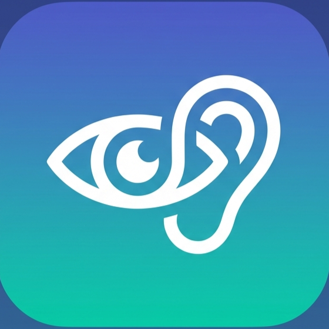

# DekhoSuno

<div align="center">
  <!--  -->
  <br />
  
  [](https://flutter.dev)
  [](https://dart.dev)
  [](https://opensource.org/licenses/MIT)
  [](https://www.android.com)

  <h3>Bridging the Gap with AI-Powered Accessibility</h3>
</div>

<br />

**DekhoSuno** is a comprehensive accessibility assistant designed to empower individuals with visual and hearing impairments. By leveraging advanced AI technologies like **Google Gemini**, **ML Kit**, and **Porcupine**, the application provides real-time understanding of the physical world through both auditory and visual feedback.

---

## 🌟 Key Features

### 👁️ Dekho Mode (Visual Assistance)
Designed for visually impaired users to "see" the world through sound.
- **Smart Object Detection**: Instantly identifies and announces objects in the camera frame using ML Kit.
- **AI Scene Analysis**: Uses **Google Gemini** to provide detailed, natural language descriptions of complex scenes.
- **Text Recognition**: Reads printed and handwritten text aloud (OCR).
- **Currency Reader**: Identifies currency notes for financial independence.
- **Light Detection**: Auditory feedback to locate light sources in a room.

### 👂 Suno Mode (Hearing Assistance)
Designed for hearing impaired users to "hear" the world through visuals.
- **Live Transcribe**: Converts speech to text in real-time for easier communication.
- **Sound Recognition**: Visual alerts for critical sounds (e.g., doorbells, alarms, sirens).
- **Sign Language Learning**: Interactive modules to learn and practice sign language.

### 🛡️ Safety & Core Utilities
- **Hands-Free Control**: Full voice command support initiated by the wake word **"Hey Assistant"**.
- **Shake-to-SOS**: Instantly sends emergency alerts with location data when the phone is shaken.
- **Haptic Feedback**: Vibration patterns for silent notifications and navigation.

---

## 🛠️ Technology Stack

- **Framework**: [Flutter](https://flutter.dev) (Dart)
- **Generative AI**: [Google Gemini Pro Vision](https://deepmind.google/technologies/gemini/) (Multimodal analysis)
- **Computer Vision**: [Google ML Kit](https://developers.google.com/ml-kit) (Object/Text Detection)
- **Voice AI**: [Porcupine](https://picovoice.ai/platform/porcupine/) (Wake Word), [Speech-to-Text](https://pub.dev/packages/speech_to_text) & [Flutter TTS](https://pub.dev/packages/flutter_tts)
- **State Management**: Provider

---

## 🚀 Getting Started

### Prerequisites
- **Flutter SDK**: [Install Flutter](https://docs.flutter.dev/get-started/install)
- **Android Studio / VS Code**: With Flutter & Dart plugins.
- **API Keys**:
  - **Google Gemini API Key**: Get it from [Google AI Studio](https://makersuite.google.com/).

### Installation

1. **Clone the Repository**
   ```bash
   git clone https://github.com/chandanpandeys/DekhoSuno.git
   cd DekhoSuno
   ```

2. **Install Dependencies**
   ```bash
   flutter pub get
   ```

3. **Configure Environment**
   Create a `.env` file in the root directory:
   ```env
   GEMINI_API_KEY=your_actual_api_key_here
   ```

4. **Run the App**
   Connect a physical Android device or start an emulator:
   ```bash
   flutter run
   ```

---

## 📂 Project Structure

```
lib/
├── screens/
│   ├── audio/           # Suno Mode Screens (Hearing Impaired)
│   ├── visual/          # Dekho Mode Screens (Visually Impaired)
│   ├── landing_screen.dart
│   └── assistant_screen.dart
├── services/
│   ├── gemini_service.dart    # AI Vision & Chat Logic
│   ├── ml_service.dart        # ML Kit Integration
│   └── wake_word_service.dart # Porcupine Voice Control
├── widgets/             # Reusable UI Components
└── main.dart            # Entry Point
```

---

## 🤝 Contributing

Contributions are welcome!
1. Fork the Project
2. Create your Feature Branch (`git checkout -b feature/AmazingFeature`)
3. Commit your Changes (`git commit -m 'Add some AmazingFeature'`)
4. Push to the Branch (`git push origin feature/AmazingFeature`)
5. Open a Pull Request

---

## 📄 License

This project is licensed under the MIT License - see the [LICENSE](LICENSE) file for details.

---

<div align="center">
  <i>Developed with ❤️ for a more inclusive world.</i>
</div>
